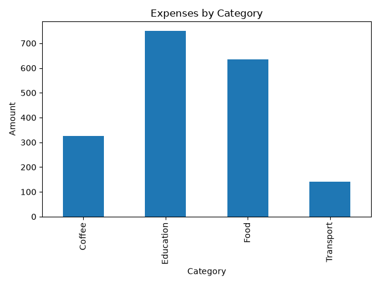

# Personal Expense Analyzer

A beginner-friendly Python project that analyzes personal expense data from a CSV file using Pandas and visualizes spending by category with Matplotlib.

## Features

* Reads expense data from a CSV file
* Calculates total spending
* Calculates average spending
* Groups expenses by category
* Identifies the highest spending category and amount
* Generates a bar chart of spending by category

## Technologies

* Python
* Pandas
* Matplotlib

## Project Structure

```text
02-expense-analyzer/
├── expense_analyzer.py
├── expenses.csv
├── expense_chart.png
├── requirements.txt
└── README.md
```

## Visualization




## How to Run

Install the required libraries:

```bash
pip install -r requirements.txt
```

Then run:

```bash
python expense_analyzer.py
```

## What I Practiced

Through this project, I practiced working with CSV files, Pandas DataFrames, aggregation methods such as `sum()` and `mean()`, grouping data with `groupby()`, and creating basic data visualizations with Matplotlib.
