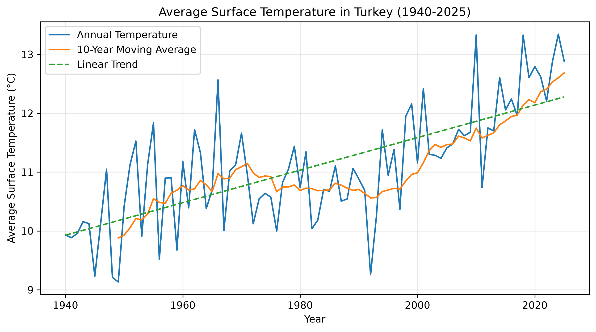

# Climate Data Explorer 🌍

A Python data analysis project exploring long-term changes in Turkey's annual average surface temperature from 1940 to 2025.

## Project Overview

This project analyzes historical surface temperature data for Turkey using Python.

The analysis focuses on:

- Exploring and filtering climate data
- Calculating descriptive statistics
- Identifying the warmest and coldest years
- Computing a 10-year moving average
- Estimating the long-term linear temperature trend
- Visualizing temperature changes over time

## Key Findings

- The dataset contains 86 annual observations for Turkey from 1940 to 2025.
- The lowest annual average surface temperature was approximately **9.13 °C** in **1949**.
- The highest annual average surface temperature was approximately **13.34 °C** in **2024**.
- Annual temperatures show substantial year-to-year variability.
- The 10-year moving average reveals a clearer long-term warming pattern.
- The estimated linear trend over 1940–2025 is approximately **+0.28 °C per decade**.

> The linear trend summarizes the overall pattern across the full period and should not be interpreted as a constant temperature increase in every individual decade.

## Visualization



The visualization compares annual temperature observations, the 10-year moving average, and the estimated linear trend.

## Technologies

- Python
- Pandas
- NumPy
- Matplotlib
- Jupyter Notebook

## Project Structure

```text
03-climate-data-explorer/
├── data/
├── notebooks/
│   └── 01_exploration.ipynb
├── src/
├── visualizations/
│   └── turkey_temperature_trend.png
├── README.md
└── requirements.txt