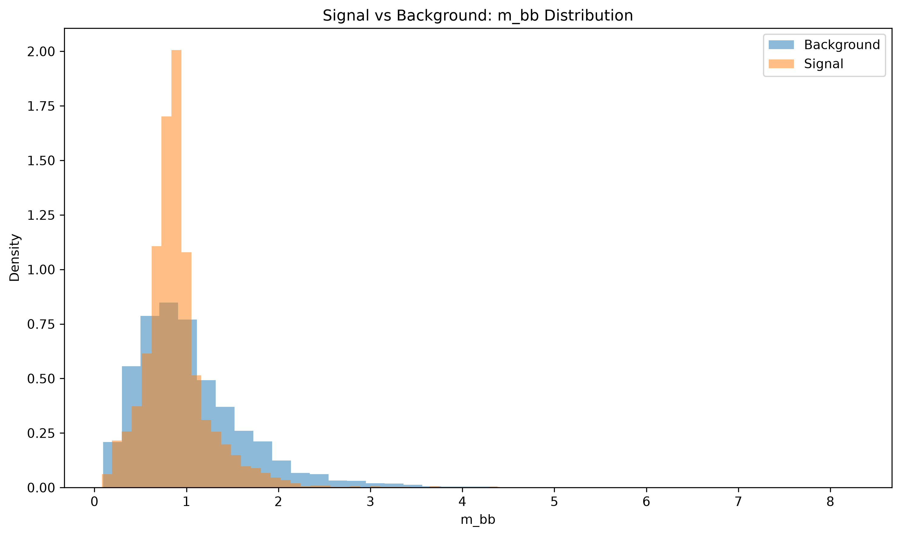
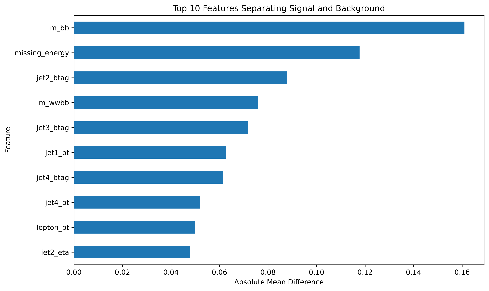

# Particle Collision EDA

This project explores a subset of the HIGGS dataset using exploratory data analysis techniques in Python.

The dataset contains simulated particle collision events generated with Monte Carlo methods. The goal is to compare signal and background events and identify features that show noticeable differences between the two classes.

## Dataset

- Source: HIGGS Dataset — UCI Machine Learning Repository
- Number of events used: 10,000
- Number of columns: 29
- Signal events: 5,295
- Background events: 4,705

## Questions Explored

- How balanced are the signal and background classes?
- Which features show the largest differences between signal and background events?
- How do selected physics-related variables differ between the two classes?
- Are there visible correlations between selected variables?

## Key Findings

- The dataset is relatively balanced between signal and background events.
- `m_bb` showed the largest absolute difference between signal and background mean values.
- `missing_energy` showed the second-largest mean difference.
- Several b-tagging related features also appeared among the top differentiating variables.
- `missing_energy` and `m_wwbb` showed a moderate positive correlation of approximately 0.31.

These results are exploratory and do not imply that the variables with the largest mean differences are necessarily the most important features for a machine learning model.

## Visualizations

### Missing Energy vs m_wwbb


### Signal vs Background — m_wwbb


### Signal vs Background — m_bb



### Top 10 Features by Absolute Mean Difference



## Technologies

- Python
- pandas
- matplotlib

## How to Run

Install the required dependencies:

```bash
pip install -r requirements.txt