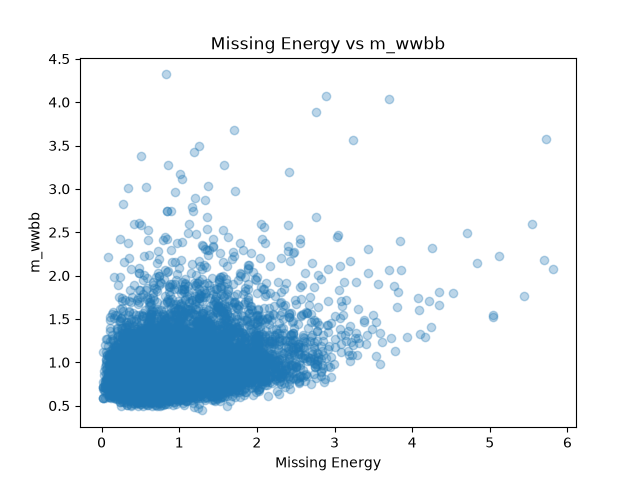

# Particle Collision EDA ⚛️

A beginner-friendly exploratory data analysis project using simulated high-energy physics collision data from the HIGGS dataset.

The goal of this project is to practice exploratory data analysis (EDA) with Python while exploring differences between simulated **signal** and **background** collision events.

## Dataset

This project uses a 10,000-event subset of the **HIGGS dataset**.

The dataset was generated using Monte Carlo simulations and contains:

* 10,000 collision events
* 29 columns
* 1 binary event label
* 21 low-level kinematic features
* 7 high-level physics features

The event labels are:

* `1` — Signal
* `0` — Background

## Analysis

The project explores the dataset using:

* Descriptive statistics
* Signal and background event counts
* Grouping and aggregation
* Comparison of selected physics features
* Pearson correlation analysis
* Scatter plot visualization

## Key Findings

The dataset contains:

* **5,295 signal events**
* **4,705 background events**

The classes are therefore relatively balanced.

Among the selected features, the largest difference in mean values between signal and background events was observed for `missing_energy`.

For the three investigated features:

* `lepton_pt` and `missing_energy`: **r ≈ -0.147**
* `lepton_pt` and `m_wwbb`: **r ≈ 0.142**
* `missing_energy` and `m_wwbb`: **r ≈ 0.313**

The strongest linear relationship among these selected variables was between `missing_energy` and `m_wwbb`, showing a positive but not strong correlation.

## Visualization

The scatter plot below shows the relationship between `missing_energy` and `m_wwbb`.

The plot suggests a positive but relatively weak linear relationship, consistent with the Pearson correlation coefficient of approximately **0.313**.

## Technologies

* Python
* Pandas
* Matplotlib

## What I Practiced

This project was created to practice newly learned exploratory data analysis concepts on a scientific dataset, including `describe()`, `value_counts()`, `groupby()`, correlation analysis, and data visualization.

## Data Source

HIGGS Dataset — UCI Machine Learning Repository

The dataset consists of simulated particle collision events generated using Monte Carlo methods.
